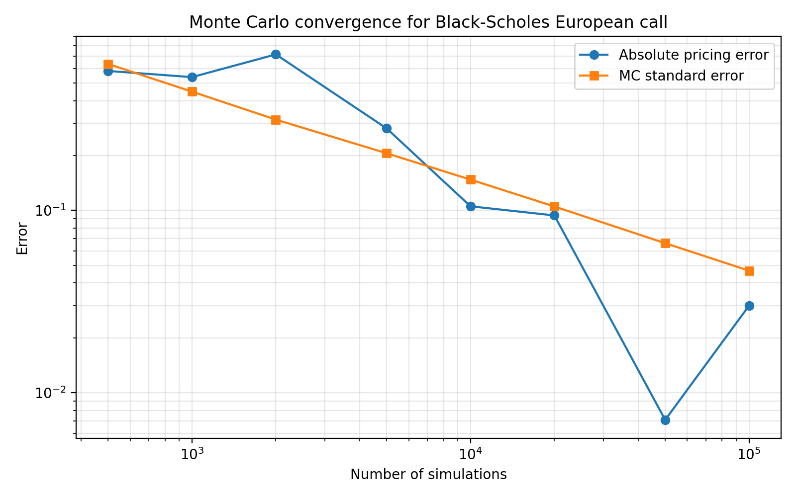
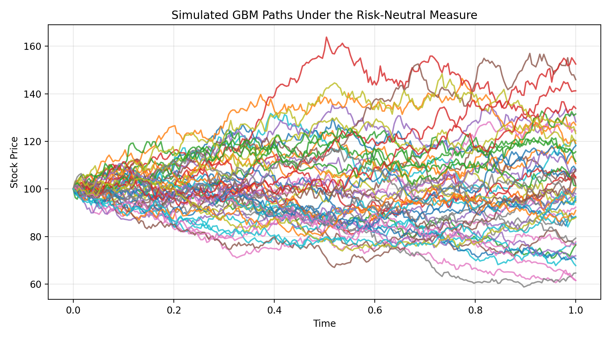
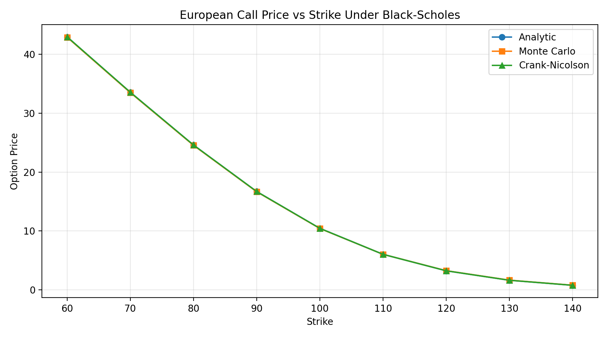

# Black–Scholes Pricing Methods

A small quantitative finance project comparing several numerical approaches to pricing European options under the Black–Scholes model.

The project implements and compares three fundamental approaches to derivative pricing:

- **Analytical solution** (Black–Scholes closed form)
- **Monte Carlo simulation** of the underlying stochastic process
- **Finite-difference PDE solvers** (explicit scheme and Crank–Nicolson)

The goal is to illustrate how different mathematical formulations of the same pricing problem lead to consistent results while exhibiting different numerical properties.

---

# Mathematical Background

Under the risk-neutral measure, the stock price follows **geometric Brownian motion**:

$$
dS_t = r S_t \, dt + \sigma S_t \, dW_t
$$

where

- $r$ is the risk-free interest rate  
- $\sigma$ is volatility  
- $W_t$ is standard Brownian motion  

Under these dynamics, the price of a European derivative with payoff $f(S_T)$ is given by the **risk-neutral pricing formula**:

$$
V_0 = e^{-rT}\mathbb{E}[f(S_T)]
$$

For a European call option:

$$
f(S_T) = \max(S_T - K, 0)
$$

This expectation can be computed in several ways.

---

## 1. Analytical Solution

Black and Scholes derived a closed-form solution:

$$
C = S_0 N(d_1) - K e^{-rT} N(d_2)
$$

where

$$
d_1 = \frac{\ln(S_0/K) + (r + \tfrac12\sigma^2)T}{\sigma\sqrt{T}}, \quad
d_2 = d_1 - \sigma\sqrt{T}
$$

---

## 2. Monte Carlo Simulation

Using the exact solution of the GBM SDE:

$$
S_T = S_0 \exp\left((r - \tfrac12\sigma^2)T + \sigma \sqrt{T} Z\right)
$$

with $Z \sim N(0,1)$.

Simulating many such paths allows the expectation to be approximated numerically.

---

## 3. PDE Formulation

The option price also satisfies the **Black–Scholes PDE**:

$$
\frac{\partial V}{\partial t} + \frac{1}{2} \sigma^2 S^2 \frac{\partial^2 V}{\partial S^2} + r S \frac{\partial V}{\partial S} - rV = 0
$$

with terminal condition:

$$
V(S,T) = \max(S-K,0)
$$

This PDE can be solved numerically using finite-difference methods.

---

# Implemented Methods

| Method | Description |
|------|------|
| Analytical | Closed-form Black–Scholes formula |
| Monte Carlo | Risk-neutral simulation of GBM paths |
| Explicit finite difference | Direct discretization of the Black–Scholes PDE |
| Crank–Nicolson | Stable semi-implicit finite-difference scheme |

---

# Example Results

For the following parameters:

- $S_0 = 100$
- $K = 100$
- $T = 1$
- $r = 0.05$
- $\sigma = 0.20$

The computed option prices are:

| Method | Price |
|------|------|
| Analytical | 10.4506 |
| Monte Carlo | 10.4876 (sampling noise) |
| Crank–Nicolson | 10.4481 |
| Explicit FD | 10.4482 |

This illustrates that:

- **Monte Carlo converges slowly** but is flexible  
- **Crank–Nicolson provides stable and accurate PDE solutions**  
- **Explicit finite differences are conditionally stable**

---

# Runtime Comparison

Approximate runtimes for the above configuration:

| Method | Runtime |
|------|------|
| Analytical | 0.000007 s |
| Monte Carlo | 0.010647 s |
| Crank–Nicolson | 0.084510 s |
| Explicit FD | 0.738353 s |

This highlights the tradeoffs between pricing methods:

- **Analytical solutions are fastest** when available.
- **Monte Carlo is flexible** but converges slowly.
- **PDE solvers are deterministic and accurate**, though computationally heavier.

---

# Monte Carlo Convergence

Monte Carlo pricing error decreases with the expected rate

$$
\text{error} \propto N^{-1/2}
$$

where $N$ is the number of simulated paths.

Example convergence plot:



---

# Simulated GBM Paths

Example sample paths under the risk-neutral measure:



---

# Price vs Strike Comparison

Pricing methods remain consistent across a range of strike prices.



---

# Running the Experiments

Install the project in editable mode:

```bash
pip install -e .
```

# Generate all figures:

Generate all figures:

```bash
python experiments/generate_all.py
```

# Project Structure

```bash
black_scholes_methods/
    analytic_black_scholes.py
    monte_carlo_pricing.py
    gbm_simulation.py
    finite_difference_pricing.py
    crank_nicolson_pricing.py

experiments/
    convergence_tests.py
    runtime_comparison.py
    strike_sweep.py
    gbm_paths.py
```

# Key Insights

This project highlights the relationship between three perspectives on derivative pricing:

    Stochastic calculus  → Monte Carlo simulation
    PDE methods          → finite difference solvers
    Closed-form analysis → Black–Scholes formula

These approaches are mathematically connected through the **Feynman–Kac theorem**, which links stochastic expectations to solutions of parabolic PDEs.

# Possible Extensions

Future work could include:

- American option pricing
- stochastic volatility models (Heston)
- implied volatility surface construction
- variance reduction techniques for Monte Carlo